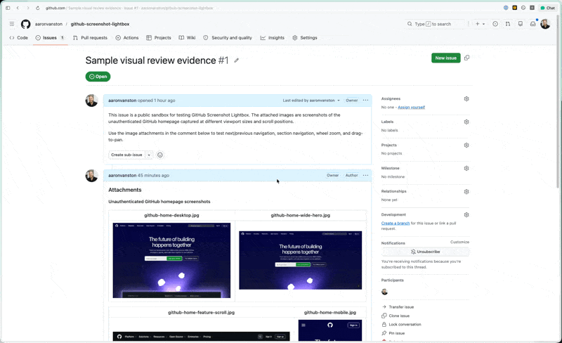

# GitHub Screenshot Lightbox



A tiny browser extension and userscript that opens GitHub issue, pull request, and comment screenshots in an in-page lightbox instead of a new tab.

## Why This Exists

AI-assisted development works best when agents attach evidence to the work they produce: screenshots, GIFs, UI states, before/after comparisons, and visual proof that a change behaves as expected. GitHub already makes it easy to drop that evidence into pull request descriptions and comments, but reviewing it is awkward because image attachments usually open in a new tab.

This extension keeps that evidence in context. Click an attached screenshot or GIF in a pull request and it opens in a lightweight viewer over the page, with next/previous navigation, section navigation, zooming, and panning. The goal is to make visual review feel closer to inspecting the work in place, without losing the comment, discussion, or surrounding implementation context.

## Features

- Opens GitHub image attachments in a lightweight overlay.
- Supports left/right arrow keys, on-screen controls, and touch swipes.
- Shows the file name, section position, and posted time when GitHub exposes it.
- Includes previous/next section controls that keep the underlying page aligned with the active comment.
- Supports click-to-zoom, cursor-centered wheel zoom, zoom buttons, and drag-to-pan while zoomed in.
- Closes with `Esc`, the close button, or backdrop click.
- Preserves native browser behavior for Cmd-click, Ctrl-click, Shift-click, Alt-click, and middle-click.
- Runs as either an unpacked Chromium extension or a userscript/site script.
- Has no runtime dependencies. Bun is only used to build the checked-in content script from TypeScript source.

## Install

### Chromium-Based Browsers

1. Clone or download this repository.
2. Open your Chromium-based browser's extensions page.
3. Enable developer mode.
4. Load this folder as an unpacked extension.

The extension injects `github-screenshot-lightbox.user.js` on `https://github.com/*`.

To update an existing unpacked install, pull the latest changes, click reload on the extension card, and refresh any open GitHub tabs.

### Userscript or Site Script

Install `github-screenshot-lightbox.user.js` in a userscript manager or browser site-script feature with this match pattern:

```text
https://github.com/*
```

The metadata block at the top of the generated file is a JavaScript comment, so it is safe to paste the full file into browser tools that accept raw JavaScript.

## Controls

| Action | Control |
| --- | --- |
| Open | Click a GitHub image attachment |
| Next | Right arrow, next button, or swipe left |
| Previous | Left arrow, previous button, or swipe right |
| Next section | Shift-right arrow or next section button |
| Previous section | Shift-left arrow or previous section button |
| Zoom | Click image, mouse wheel, `+`, `-`, `0`, or zoom buttons |
| Pan | Drag while zoomed in |
| Close | `Esc`, close button, or backdrop click |
| Native new tab | Cmd-click, Ctrl-click, Shift-click, Alt-click, or middle-click |

## Supported GitHub Image URLs

The script targets direct image links and common GitHub attachment hosts:

- `github.com/user-attachments/assets/...`
- `user-images.githubusercontent.com`
- `private-user-images.githubusercontent.com`
- `camo.githubusercontent.com`
- direct `.png`, `.jpg`, `.jpeg`, `.gif`, `.webp`, `.avif`, `.svg`, `.bmp`, and `.apng` links

## Development

Source lives in `src/`. The browser extension loads the generated `github-screenshot-lightbox.user.js` file at the project root.

```bash
bun run check
```

`bun run check` rebuilds the generated userscript and confirms the build completed. To rebuild without the extra confirmation:

```bash
bun run build
```

After rebuilding, reload the unpacked extension and refresh any open GitHub tabs.

The generated `github-screenshot-lightbox.user.js` file is committed on purpose so the repository can be loaded directly as an unpacked extension or pasted into a userscript tool without a build step.

## Privacy

The extension does not collect analytics, store browsing data, or send data to a server. It only runs on GitHub pages and only manipulates links and images already present in the page.
